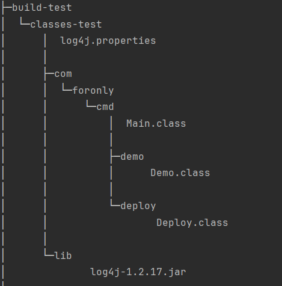

# 仅以java命令运行原生java项目

### windows环境下(默认已经配好java环境)

1. 前提：手动将代码编译如下格式
```shell
# 将代码编译到  build-test\classes-test 目录下
cd only-native-java
javac -cp .;src\main\resources\lib\log4j-1.2.17.jar -d build-test\classes-test src\main\java\com\foronly\cmd\demo\*.java src\main\java\com\foronly\cmd\deploy\*.java src\main\java\com\foronly\cmd\*.java
# 接着需要手动复制resources下的所有文件到build-test\classes-test目录下
xcopy /s /i src\main\resources build-test\classes-test
```
   
2. 进入到only-native-java 项目,执行一下命令执行项目
```shell
cd only-native-java
```

```shell
# 简要命令
java -classpath .;build-test\classes-test;build-test\classes-test\lib\log4j-1.2.17.jar com.foronly.cmd.Main
```
或
```shell
# 加上字符编码参数
java -Dfile.encoding=UTF-8 -Dsun.stdout.encoding=UTF-8 -Dsun.stderr.encoding=UTF-8 -classpath .;build-test\classes-test;build-test\classes-test\lib\log4j-1.2.17.jar com.foronly.cmd.Main
```

3. 最终演示
    


javac   -cp .;src\main\resources\lib\log4j-1.2.17.jar -d build-test\classes-test -sourcepath src\main\java src\main\java\com\foronly\cmd\**\*.java